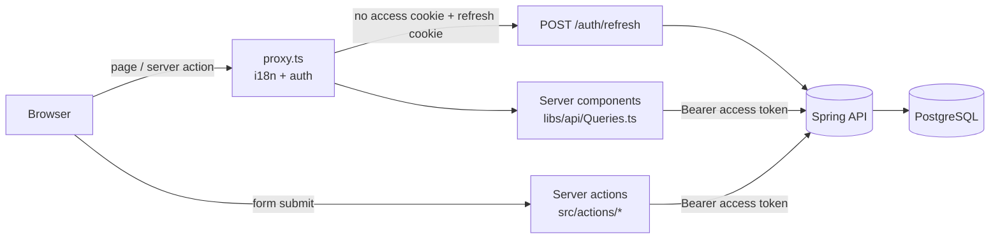

# Architecture

## Request flow

The browser never talks to the backend and never sees a token. Everything goes through the
Next.js server, which holds the session in two **httpOnly** cookies.

## Session design

| Cookie | Holds | Lifetime |
|---|---|---|
| `access_token` | backend JWT (15 min by default) | token lifetime − 30 s |
| `refresh_token` | backend refresh token (rotates on use) | refresh-token lifetime |

- **Sign-in/sign-up** (`src/actions/AuthActions.ts`) call the backend and set both cookies.
- **Protected pages** (`/dashboard/**`, any locale) go through `src/proxy.ts`. With no access
  cookie but a refresh cookie, it calls `/auth/refresh`, sets the new cookies on the request (so
  this render already uses them) and on the response (so the browser keeps them). With neither,
  it redirects to `/sign-in`.
- Because each cookie expires with its token, "is the access cookie present?" is the only check
  needed: no JWT decoding in the frontend.
- **A failed refresh does not delete cookies.** Two tabs can refresh at once and, with rotation,
  the second one loses; deleting would sign out the tab that just succeeded.
- **Sign-out** revokes the refresh token on the backend (best effort) and clears both cookies.
- A backend **401** anywhere else (e.g. a deleted account) redirects to `/sign-in`.
- Cookies are `Secure` when `APP_URL` is `https://`.

## Where code goes

| Need | Put it in |
|---|---|
| A page | `src/app/[locale]/(marketing)` (public) or `(auth)/dashboard` (signed in) |
| Read data for a page | a function in `src/libs/api/Queries.ts` |
| Change data | a server action in `src/actions/` (validate with zod, map errors, revalidate) |
| Validation rules | `src/validations/`, mirroring the backend's request constraints |
| Text | `src/locales/en.json` **and** every other locale |
| Env var | `src/libs/Env.ts` + [configuration.md](configuration.md) + `env/.env.example` |

## Rendering

Public pages are statically generated per locale. Everything under `dashboard` is
`force-dynamic`: personal data is never prerendered or cached.

## Deployment shape

`docker/Dockerfile` builds Next's standalone server (non-root, `node server.js`). The same image
runs in every environment; `BACKEND_URL` and `APP_URL` are read at startup, not baked in.
